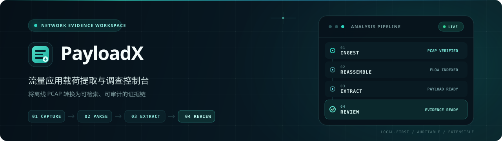

<p align="center">
  
</p>

<p align="center">
  <strong>PayloadX</strong> · 流量应用载荷提取与调查控制台<br/>
  <em>捕获 → 解析 → 重组 → 提取 → 研判</em>
</p>

<p align="center">
  <a href="#快速开始"></a>
  <a href="LICENSE"></a>
  <a href="https://www.python.org/"></a>
  <a href="https://react.dev/"></a>
  <a href="backend/requirements.txt"></a>
  <a href=".github/workflows/ci.yml"></a>
  <a href="docker-compose.yml"></a>
</p>

<p align="center">
  <a href="#快速开始">快速开始</a> ·
  <a href="docs/ARCHITECTURE.md">架构说明</a> ·
  <a href="docs/API.md">接口文档</a> ·
  <a href="docs/DEPLOYMENT.md">部署指南</a> ·
  <a href="docs/ROADMAP.md">路线图</a>
</p>

---

## 这是什么

**PayloadX** 是一款面向网络运维、安全分析与教学场景的 **PCAP 应用层载荷提取系统**。

把离线抓包文件变成可检索、可审计的 Web 台账：

**任务 → 会话（五元组）→ 载荷 → 告警**

| 你的需求 | PayloadX |
|----------|----------|
| 批量处理 PCAP，而不是只开 Wireshark | ✅ 异步任务 + 进度 |
| 按会话看流量 | ✅ 五元组聚合 |
| 提取 HTTP / DNS 等应用内容 | ✅ 可扩展解析器 |
| 结构化预览 + Hex 对照 | ✅ 载荷多视图 |
| 给别的系统调用 | ✅ REST + OpenAPI |
| 本地部署、开源可改 | ✅ MIT · Docker · SQLite |

> **诚实边界：** 没有密钥时，无法解密 HTTPS 应用明文；系统只提取 TLS 元数据/样例，不假装“破解加密”。

---

## 功能一览

| 模块 | 能力 |
|------|------|
| **接入** | PCAP 上传、体积限制、文件落盘 |
| **解析** | 标准库以太网/IPv4/TCP/UDP（核心路径不依赖 Scapy） |
| **提取** | HTTP、DNS、TLS 启发式；敏感字段告警 |
| **研判** | 仪表盘、协议统计、载荷检索、风险标签 |
| **运维** | 结构化日志、系统配置、重新解析、Compose 部署 |
| **开发体验** | Vite `/api` 代理、一键启动脚本、CI |

---

## 技术栈

```text
┌─────────────┐     /api/v1      ┌──────────────────┐
│  React 19   │ ───────────────► │  FastAPI          │
│  TS + Vite  │   （开发代理）     │  SQLAlchemy 2     │
│  Tailwind   │                  │  标准库 PCAP 引擎  │
└─────────────┘                  └────────┬─────────┘
                                          │
                               ┌──────────┴──────────┐
                               │ SQLite / MySQL      │
                               │ uploads/*.pcap      │
                               └─────────────────────┘
```

完整架构图见 [`docs/ARCHITECTURE.md`](docs/ARCHITECTURE.md)。

---

## 界面预览

> 发布前请将真实截图放入 `docs/assets/screenshots/`（建议 1600×900）。

| 工作台 | 载荷详情 | 流量捕获 |
|--------|----------|----------|
| 指标卡 · 协议占比 · 最近任务 | 预览 / Hex / 元数据 | 上传 · 任务进度 |

Logo：[`public/logo.svg`](public/logo.svg) · Banner：[`docs/assets/banner.svg`](docs/assets/banner.svg)

---

## 快速开始

### 方式 A：本地开发（推荐）

**环境：** Python 3.11+ · Node 20+

```bash
# 1）后端
cd backend
python -m venv .venv
# Windows
.\.venv\Scripts\Activate.ps1
pip install -r requirements.txt
uvicorn app.main:app --reload --host 127.0.0.1 --port 8001

# 2）前端（新开终端，项目根目录）
npm install
npm run dev
```

- 控制台：**http://127.0.0.1:5173**
- 接口文档：**http://127.0.0.1:8001/docs**

Windows 一键启动：

```powershell
powershell -ExecutionPolicy Bypass -File .\scripts\start-all.ps1
```

### 方式 B：Docker Compose

```bash
docker compose up --build -d
```

- 页面：http://localhost:8080  
- API：http://localhost:8001/docs  

首次启动会自动生成演示 PCAP 并完成解析。

---

## 接口概览

| 方法 | 路径 | 说明 |
|------|------|------|
| `GET` | `/api/v1/health` | 健康检查 |
| `GET` | `/api/v1/dashboard` | 总览指标 |
| `POST` | `/api/v1/tasks/upload` | 上传 PCAP（`multipart`） |
| `GET` | `/api/v1/tasks` | 任务列表 |
| `GET` | `/api/v1/sessions` | 会话流 |
| `GET` | `/api/v1/payloads` | 载荷列表 |
| `GET` | `/api/v1/alerts` | 告警 |
| `GET` | `/api/v1/logs` | 运行日志 |

完整说明：[`docs/API.md`](docs/API.md) · 交互文档：`/docs`（Swagger）。

---

## 目录结构

```text
payloadx/
├── src/                      # React 控制台
├── backend/
│   ├── app/
│   │   ├── api/              # REST
│   │   ├── services/         # 解析与任务
│   │   ├── models/           # 数据模型
│   │   └── core/             # 配置与日志
│   ├── tests/                # pytest
│   └── Dockerfile
├── deploy/nginx.conf         # 生产反代示例
├── docs/                     # 产品与架构文档
├── scripts/                  # 启动脚本
├── docker-compose.yml
└── .github/workflows/ci.yml
```

---

## 性能说明（实验室基线）

在演示 PCAP（HTTP + DNS，3 个包）与笔记本小流量样本上：

| 指标 | 观察 |
|------|------|
| 演示样本解析 | 端到端通常 **&lt; 100 ms** |
| 核心解析依赖 | **无** 原生抓包库 |
| 并发模型 | v1 为 **每任务后台线程**；队列调度见路线图 |
| 默认上传上限 | **512 MB**（可配置） |
| 流缓冲 | 单侧约 64KB 上限，控制内存 |

正式公开数据集上的压测表将在后续版本补充。

---

## 路线图

详见 [`docs/ROADMAP.md`](docs/ROADMAP.md)。

| 版本 | 方向 |
|------|------|
| **v1.0** | 解析闭环 · Web 台账 · CI · Docker（当前） |
| **v1.1** | 登录鉴权 · PCAPNG · 导出 |
| **v1.2** | MQTT/WebSocket · 任务队列 · 规则 DSL |
| **v2.0** | 多用户工作区 · 解析插件 · SSO |

---

## 常见问题

**Q：上传 PCAPNG 失败？**  
A：v1 优先支持经典 PCAP。请用 Wireshark：`文件 → 导出特定分组 → pcap`。

**Q：为什么看不到 HTTPS 正文？**  
A：无会话密钥时无法合法解密。系统只展示 TLS 相关元数据/样例。

**Q：能替代 Wireshark 吗？**  
A：不能。PayloadX 是 **任务台账 + 载荷提取控制台**，不是全协议手工分析器。

**Q：能用 MySQL 吗？**  
A：可以。设置  
`DATABASE_URL=mysql+pymysql://用户:密码@主机/库名`  
并安装 `pymysql`。

**Q：能直接上生产吗？**  
A：适合 **实验室 / 内网 / 教学**。多用户生产环境请先加鉴权、反代与存储加固。

---

## 参与贡献

欢迎提 Issue 与 PR。请先阅读：

- [贡献指南](CONTRIBUTING.md)
- [行为准则](CODE_OF_CONDUCT.md)

```bash
cd backend && pip install -r requirements-dev.txt && pytest -q
npm run build
```

---

## 安全

请勿在公开 Issue 中披露未修复漏洞。报告方式见 [SECURITY.md](SECURITY.md)。

提取出的载荷可能含账号口令等敏感信息，请按涉密数据处理。

---

## 开源协议

[MIT](LICENSE) © PayloadX 贡献者

---

<p align="center">
  <sub>PayloadX — 本地优先的流量载荷提取与调查控制台</sub>
</p>
